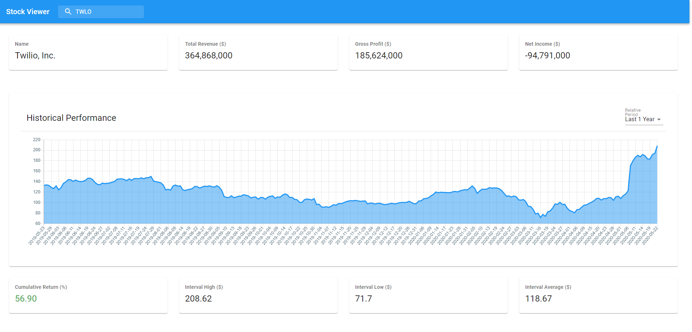

# Stock Viewer
## Description
This is a fully responsive stock viewer application built using Material UI, React / Redux and served via Webpack. Search by entering a ticker like 'AAPL' or 'TSLA' to see summary and income information as well as a historical performance chart. Historical close prices can be viewed over 1M, 3M, 1Y, 2Y and 5Y. Over each of these intervals, the cumulative return is computed - assuming you bought at the close price at the very beginning of the interval, and sold at the close price at the very end of the interval. The minimum, maximum and average close prices are also computed across these intervals. 
## Screenshot

## System Requirements
To run, you need: Node Server (LTS  Version) and NPM
## Install Dependencies
npm install
## Run Project
npm start
